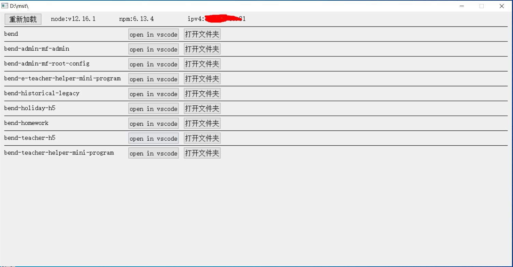

# my_workdir_exe
- 此软件适合前端开发人员使用，适合window是平台使用。
- 打开软件，显示自己的项目列表，提供vscode快捷打开，及打开文件夹功能。如图：
### 使用方法

1. 下载[autoit3](https://www.autoitscript.com/site/autoit/downloads/)
2. 修改代码中目录地址（改成自己的目录，目录中应包含你所有的项目）如图：
3. 使用下载好的autoit3(自带有编辑器)
4. 自此 会得到一个.exe文件，双击就可以打开啦！

